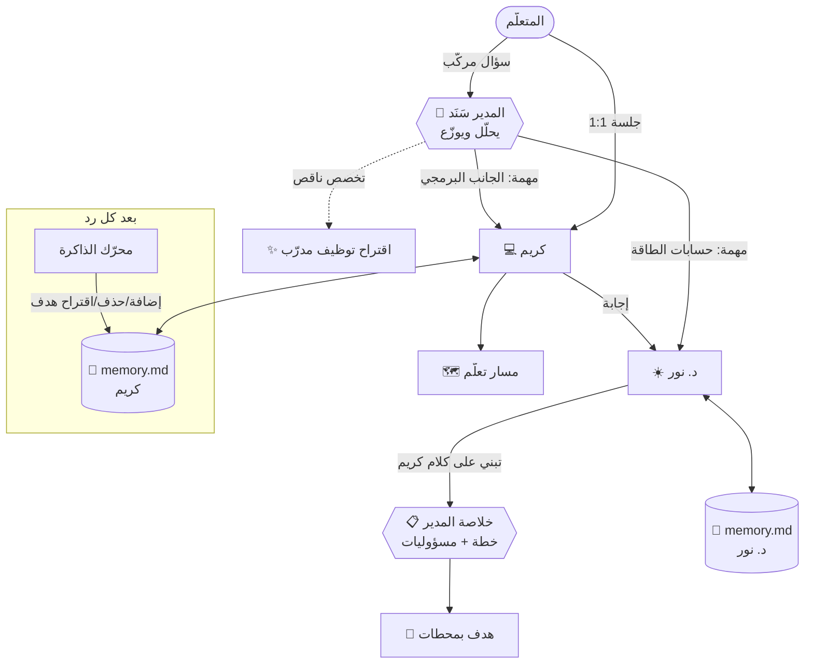

# مجلس — Majlis
### فريق مدرّبيك الشخصي بالذكاء الاصطناعي: مدرّبون تصمّمهم أنت، يتذكّرونك، ويعملون معاً تحت إدارة مدير ذكي

---

## 1. الفكرة بجملة واحدة

**«مجلس» ليس شات بوت، بل أكاديمية شخصية كاملة:** تبني فريقاً من المدرّبين الأذكياء، لكل واحد تخصص دقيق وشخصية وشكل تختاره، وذاكرة خاصة (ملف حقيقي تقرأه وتعدّله). وفوقهم **مدير المجلس** الذي يفهم ما تحتاجه، ويوزّع العمل على المختص، ويجمع الخلاصة، ويذكّرك بأهدافك كل يوم.

> الاسم «مجلس» مقصود: هو المكان الذي يجلس فيه أهل الخبرة حول طاولة واحدة ليتشاوروا لأجلك. وهذا بالضبط ما يحدث في المنصة.

---

## 2. المشكلة الحقيقية

| المشكلة | ماذا يحدث اليوم |
|---|---|
| **النسيان** | ChatGPT وأمثاله ينسونك مع كل محادثة جديدة، أو يتذكّرون بشكل غامض لا تتحكم فيه. |
| **العمومية** | مساعد واحد «يعرف كل شيء» يجيب بسطحية؛ لا يوجد عمق المختص ولا منهجه. |
| **غياب المتابعة** | لا أحد يسألك غداً: «وين وصلت؟». التعلّم الذاتي يموت عادة في الأسبوع الثاني. |
| **غياب الهيكلة** | إجابات متفرقة بدل منهج متدرّج بدروس وتمارين ومحطات. |
| **شخصية واحدة للجميع** | بعض الناس يحتاجون مدرباً صارماً، وآخرون يحتاجون مشجّعاً دافئاً. لا خيار. |
| **الأسئلة المركّبة** | «كيف أبني مشروع طاقة شمسية مربح؟» سؤال هندسي ومالي وتسويقي معاً، ولا يوجد من يجمع هذه الزوايا. |

---

## 3. الحل: الركائز الست

### ① صانع المدرّبين (Mentor Forge)
تصمّم المدرّب من الصفر أو من قالب:
- **الهوية والتخصص:** الاسم، اللقب، التخصص الدقيق، نطاق العمل، والقصة.
- **الشخصية كسلوك تعليمي**، لا ديكوراً: خمس منزلقات تتحوّل مباشرة إلى تعليمات تدريس.
  - **الدفء:** من الرسمي إلى الشخص الذي يحتفل بكل تقدّم.
  - **الحزم:** من المرن إلى المحاسِب الذي لا يقبل الأعذار.
  - **الدعابة.**
  - **التفصيل:** من موجز إلى عميق.
  - **السقراطية:** من يعطيك الجواب مباشرة، إلى من يقودك بالأسئلة لتكتشفه.
- **أسلوب التدريس:** تطبيقي، بالمشاريع، بصري، قصصي، تدريب مكثّف، تحدّيات.
- **اللهجة:** فصحى، شامي، خليجي، مصري، عربي مع مصطلحات إنجليزية، أو English.
- **المظهر (أفاتار حيّ):**
  - إنسان أو روبوت، مع خيارات لون البشرة والشعر والعيون واللحية.
  - **حجاب، غترة، شماغ**، كاب، ونظارات، وسماعات وغيرها.
  - الأفاتار **يتفاعل**: يرمش، ويتحرك فمه وهو يكتب، ويفكّر (فقاعات)، ويفرح عند إنجازك.
- **الوصايا:** تعليمات دائمة يلتزم بها المدرّب، مثل «لا تعطني الحل قبل أن أحاول مرتين».
- **معاينة حيّة:** جملة نموذجية تتغيّر فوراً مع كل منزلق لتسمع كيف سيتكلم معك.

### ② الذاكرة الشفافة (ملف لكل مدرّب)
- كل مدرّب له ملف `memory.md` حقيقي (`data/mentors/<id>/memory.md`) مقسّم إلى:
  - عن المتعلّم
  - الأهداف
  - المستوى ونقاط القوة
  - ما يحتاج تحسين
  - التفضيلات
  - سجل التقدّم
- **بعد كل رد** يعمل «محرّك الذاكرة» في الخلفية، فيستخرج فقط المعلومات الدائمة والمفيدة، ويحذف القديم منها، ويمنع التكرار.
- **يظهر ذلك أمامك** على شكل شارة صغيرة: «🧠 تذكّر: يعرف أساسيات HTML».
- **أنت صاحب الكلمة الأخيرة:** تعدّل أي ملاحظة أو تحذفها أو تضيفها، وتحرّر الملف الخام، وتصدّره، أو تصفّره.
- **الفرق الجوهري:** الذاكرة هنا **مرئية ومملوكة للمستخدم**، وليست صندوقاً أسود. هذا يبني الثقة، وهو أساس الخصوصية لاحقاً.
- لكل مدرّب ذاكرته المنفصلة، مثل المدرّبين الحقيقيين: مدرّب اللياقة لا يعرف تفاصيل مشاكلك مع الكود، إلا ما يشاركه المدير.

### ③ المدير والمجلس (Multi-Agent)
- **«اسأل المجلس»:**
  - تطرح سؤالاً واحداً، فيحلّل المدير (سَنَد) السؤال ويقرّر من يجيب، ويعطي كل مدرّب **مهمة محددة** («كريم: الجانب البرمجي»، «د. نور: حسابات الأحمال»).
  - يجيب المدرّبون بالترتيب، وكل واحد **يرى كلام من سبقه**، فيبني عليه أو يختلف معه باحترام.
  - في النهاية يكتب المدير **خلاصة وخطة عمل** مرقّمة، مع اسم المسؤول عن كل خطوة.
  - زر واحد يحوّل هذه الخطة إلى **هدف بمحطات جاهزة**.
- **«جلسة نقاش» (Roundtable):** تختار موضوعاً ومن 2 إلى 4 مدرّبين وصيغة الجلسة (نقاش، مناظرة، عصف ذهني، تخطيط مشترك)، ثم تشاهدهم **يتحاورون بشخصياتهم**. تستطيع التدخّل بأي لحظة، والمدير يختم بالخلاصة.
- **المدير يوظّف:** إذا غاب عن الفريق تخصص يحتاجه سؤالك، يقترح عليك «صمّم مدرّباً في تصميم UX»، وزر واحد يأخذك إلى صانع المدرّبين.
- **تصوّر بصري:**
  - طاولة مستديرة، والمدير على رأسها والمدرّبون حولها.
  - خطوط تضيء نحو من تم تكليفه.
  - المتحدث يتوهّج ويتحرك فمه.
  - الباقون يخفتون.

### ④ مسارات التعلّم
- تطلب من أي مدرّب «رتّبلي مسار» وتحدد الموضوع ومستواك ووقتك الأسبوعي والمدة، فيبني منهجاً **مخصصاً بناءً على ذاكرته عنك**:
  - وحدات، وفي كل وحدة دروس.
  - لكل درس هدف قابل للقياس، ومحاور، وتمرين عملي، ومصادر موثوقة.
- **يُعرض المسار كخريطة رحلة** بطريق متعرّج: نقاط منجزة (خضراء)، ونقطة «التالي» (نابضة)، وخط تقدّم متوهّج.
- **وضع الدرس:**
  - «ابدأ الدرس مع كريم» يفتح جلسة يدرّسك فيها المدرّب الدرس **تفاعلياً**، محوراً محوراً، مع أسئلة تحقق.
  - ثم زر «أنهيت الدرس ✓»، فتحصل على نقاط واحتفال، ويُسجَّل الإنجاز في ذاكرة المدرّب.

### ⑤ الأهداف والتذكير الذكي
- هدف له مدرّب مسؤول، وموعد، ودافع («ليش مهم إلك؟»)، وتذكير يومي أو أسبوعي.
- **«رتّب الخطة»:** يحوّل المدرّب الهدف إلى صيغة SMART، ومحطات بمواعيد، و**خطوة اليوم** (15 دقيقة)، وجملة تحفيز بأسلوبه.
- **التذكير في 4 أماكن:**
  1. **موجز اليوم** من المدير على الصفحة الرئيسية (أولويات مرتّبة).
  2. **جرس التذكيرات**: أهداف متأخرة، أو قريبة الموعد، أو دروس متوقفة.
  3. **المدرّب نفسه يذكّرك** داخل المحادثة. وعند عودتك بعد غياب، **يفتتح هو الجلسة**: «اشتقنالك! هدفك باقيله 3 أيام، شو عملت؟».
  4. إشعارات المتصفح (اختيارية).
- **المدرّب يلتقط أهدافك من الحديث:** إذا قلت «بدي أنزل 5 كيلو قبل الصيف»، تظهر بطاقة «سامر يقترح هدفاً جديداً [أضف]».

### ⑥ التحفيز والمتعة
- **نقاط الخبرة ومستويات بألقاب:** مستكشف ← متعلّم ← مثابر… ← أسطورة.
- **سلسلة الأيام 🔥**، وخريطة نشاط.
- **مستوى الصلة مع كل مدرّب:** تعارف ← ثقة ← شراكة ← رفقة ← توأم فكري. يكبر كلما عملتما معاً.
- **لحظات احتفال:** قصاصات ملونة، ونغمات خفيفة، و«+50 XP» تطير، وأفاتار يفرح.

---

## 4. لماذا هذه الفكرة مختلفة؟

| | ChatGPT / Custom GPTs | Character.ai / Grok Companions | Duolingo | **مجلس** |
|---|---|---|---|---|
| تخصص عميق لكل مدرّب | جزئي | ✗ (ترفيه) | مجال واحد | ✓ |
| شخصية تتحوّل لسلوك تعليمي | ✗ | شخصية بلا منهج | ✗ | ✓ |
| ذاكرة **مرئية وقابلة للتعديل** لكل مدرّب | غامضة ومشتركة | غامضة | ✗ | ✓ |
| عدة وكلاء **يتعاونون** مع مدير يوزّع | ✗ | ✗ | ✗ | ✓ |
| مناهج مخصّصة وخريطة تقدّم | ✗ | ✗ | ثابتة | ✓ |
| متابعة أهداف واستباقية (المدرّب يبدأ الحديث) | ✗ | جزئي | إشعارات عامة | ✓ |
| عربي أولاً، بلهجات، وأفاتار بحجاب وغترة | ✗ | ✗ | ✗ | ✓ |

**الخلاصة:** نأخذ **دفء** تطبيقات الشخصيات، و**عمق** المختص، و**انضباط** تطبيقات التعلّم، و**قوة الوكلاء المتعددين**، ونضعها في تجربة واحدة مريحة وممتعة.

---

## 5. معمارية الوكلاء

**دورة حياة رسالة واحدة:**
1. يُبنى «سياق المدرّب» من: شخصيته وتخصصه، ووصاياك، وملف ذاكرته، وأهدافك، ومساراته معك، وأسماء زملائه، والوقت الحالي، والدرس الحالي إن وُجد.
2. يُبثّ الرد حرفاً بحرف (Streaming) والأفاتار «يتكلم».
3. يعمل محرّك الذاكرة (استدعاء JSON منفصل ورخيص) ويحدّث الملف، وقد يقترح هدفاً.
4. تُحتسب النقاط، وتقوى الصلة، وتُحدَّث السلسلة.

---

## 6. يوم في حياة المستخدم

- **08:10 — يفتح التطبيق.** سَنَد: «رتّبتلك أولويات اليوم: ① درس "حسابات الأحمال" مع د. نور ② هدف الموقع باقيله 4 أيام ③ كابتن سامر بانتظارك». 🔥 سلسلة 6 أيام.
- **08:12 — يضغط على الدرس.** د. نور تبدأ: «قبل ما نبدأ، شو بتعرف عن الـ kWh؟». يتعلّم خطوة بخطوة، ويحلّ التمرين، ثم «أنهيت الدرس ✓»: 🎉 +50 XP.
- **13:00 — سؤال مركّب:** «بدي أبيع خدمات تصميم أنظمة شمسية أونلاين، من وين أبدأ؟». يوزّع سَنَد السؤال: د. نور (الجانب التقني)، كريم (موقع الخدمة)، أبو فيصل (التسعير والتسويق). تأتي الخلاصة بخطة من 3 خطوات، ثم «حوّل لهدف».
- **21:00 — جلسة نقاش:** «هل أتخصص بالسكني أم التجاري؟». مناظرة بين أبو فيصل ود. نور، يتدخّل فيها المستخدم، وسَنَد يختم بتوصية.
- **بعد 3 أيام غياب:** يفتح محادثة كريم، فيبدأ كريم: «وينك يا علاء؟ 😄 وقفنا عند صفحة التواصل. خلّينا نخلصها اليوم بـ 20 دقيقة؟».

---

## 7. مبادئ تجربة المستخدم

1. **فاتح، هادئ، ومتفائل:** ألوان باستيل ناعمة، ومساحات بيضاء، وبطاقات خفيفة الظل. التعلّم يجب أن يبدو خفيفاً لا ثقيلاً. (الوضع الليلي اختياري فقط.)
2. **الشخصية مرئية:** الأفاتار ليس صورة ثابتة؛ يفكّر ويتكلم ويفرح. تشعر أن هناك «أحداً» معك.
3. **الذكاء واضح:**
   - ترى قرار المدير ولماذا اختار كل مدرّب.
   - ترى ما تذكّره المدرّب عنك.
   - ترى المهمة الموكلة لكل واحد.
4. **كل شيء على بُعد نقرة:**
   - أزرار سريعة تتغيّر حسب السياق: «اختبرني»، «بسّطها أكثر»، «لخّص الجلسة».
   - «حوّل لهدف».
   - «ابدأ الدرس».
5. **لحظات فرح صغيرة ومتكررة**، تُكافئ الاستمرارية لا الكمال.
6. **العربية أولاً** (RTL كامل)، واللهجة جزء من الشخصية.
7. **يعمل على الموبايل** بشريط تنقّل سفلي، ولوحة المدرّب تنزلق من الجانب.

---

## 8. نموذج العمل المقترح

| الشريحة | ماذا يحصل | السعر (مبدئي) |
|---|---|---|
| **مجاني** | مدير + 2 مدرّبين، ذاكرة، مسار واحد نشط | 0 |
| **Pro** | مدرّبون بلا حد، مجلس ونقاشات بلا حد، مسارات بلا حد، نموذج التفكير العميق، صوت (لاحقاً) | 5–8$ شهرياً |
| **سوق القوالب** | خبراء حقيقيون ينشرون «مدرّبين» بتخصصاتهم (مثلاً مدرّب IELTS من مدرّس معتمد) مع مشاركة أرباح | عمولة |
| **مؤسسات** | مدارس، مراكز تدريب، وشركات (Onboarding): مدرّبون مؤسسيون بمحتوى الجهة + لوحة متابعة للمشرف | ترخيص سنوي |

**لماذا DeepSeek؟** التكلفة منخفضة جداً لكل رسالة، وهذا يجعل الوكلاء المتعددين (3 إلى 5 استدعاءات لكل سؤال للمجلس) مجدياً اقتصادياً حتى في الخطة المجانية. البنية مستقلة عن المزوّد ويمكن تبديله لاحقاً.

---

## 9. مؤشرات النجاح

- **الاحتفاظ:** نسبة العائدين بعد 7 أيام وبعد 30 يوماً (الهدف: أعلى من تطبيقات الشات العامة بفضل المتابعة الاستباقية).
- **الاستمرارية:** متوسط سلسلة الأيام، وعدد الدروس المنجزة أسبوعياً لكل مستخدم.
- **الأثر:** نسبة الأهداف المحقّقة، ونسبة المسارات المكتملة.
- **الثقة:** عدد مرات فتح صفحة الذاكرة وتعديلها (مؤشر على أن المستخدم يرى قيمة الشفافية).
- **قيمة الوكلاء المتعددين:** نسبة أسئلة المجلس التي تحوّلت إلى أهداف.

---

## 10. خارطة الطريق

- **المرحلة 0 — إثبات الكونسبت ✅ (هذا المستودع)**
  - كل الركائز الست تعمل، مع وضع تجريبي بلا مفتاح وتكامل DeepSeek.
- **المرحلة 1 — الأمان والحماية**
  - حسابات مستخدمين وتسجيل دخول، وعزل بيانات كل مستخدم.
  - المفتاح في خزنة أسرار (Vault / متغيرات بيئة) مع وسيط (Proxy)، وحدود استخدام لكل مستخدم (Rate limiting وحصص).
  - تشفير ملفات الذاكرة والمحادثات.
  - حماية من حقن التعليمات (Prompt injection) في محتوى الذاكرة والمدخلات، وفلترة المخرجات.
  - سجلات تدقيق وسياسة خصوصية، مع تصدير البيانات وحذفها (GDPR).
  - نقل التخزين إلى قاعدة بيانات (Postgres) مع الإبقاء على «الذاكرة كوثيقة».
- **المرحلة 2 — تجربة أغنى**
  - **صوت لكل مدرّب** (TTS/STT) ومحادثة صوتية.
  - تطبيق PWA أو موبايل مع إشعارات Push حقيقية، وتكامل تقويم Google لجدولة الدروس.
  - **مكتبة المدرّب (RAG):** ترفع كتباً أو ملفات، فيدرّس المدرّب منها بمراجع دقيقة.
  - تمارين تفاعلية: محرّر كود، واختبارات تُصحَّح تلقائياً، وبطاقات مراجعة متباعدة.
  - «ذاكرة مشتركة» ذكية: المدير يلخّص للمدرّبين ما يلزم من ذاكرة بعضهم (بإذنك).
- **المرحلة 3 — المنصة**
  - سوق مدرّبين، ومشاركة مدرّب مع صديق، ولوحات للمؤسسات، وشهادات إنجاز.

---

## 11. المخاطر وكيف نعالجها

| الخطر | المعالجة |
|---|---|
| الهلوسة ومعلومات خاطئة | تخصص ضيّق لكل مدرّب؛ تعليمات صريحة «لا تخترع مصادر أو أرقاماً»؛ ذكر الافتراضات؛ لاحقاً RAG بمراجع. |
| تضخّم تكلفة الوكلاء | اختيار «أقل عدد كافٍ» من المدرّبين؛ ضغط الذاكرة؛ نموذج رخيص؛ حصص استخدام. |
| الخصوصية | ذاكرة مرئية وقابلة للحذف والتصدير؛ بيانات محلية في الكونسبت؛ تشفير في المرحلة 1. |
| الاعتماد الزائد / نصائح حساسة (صحة، مال) | نطاق واضح لكل مدرّب («ليس بديلاً عن الطبيب»)، وتوجيه للمختص البشري. |
| ملل المستخدم | متابعة استباقية، واحتفالات، ونقاشات بين المدرّبين (محتوى متجدد وممتع). |
